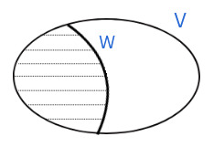
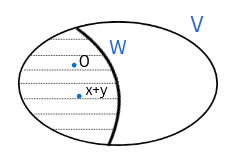
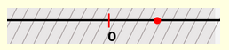
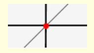
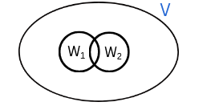

This experiment is designed to help students understand the concept of subspaces within a vector space, a foundational idea in linear algebra. By exploring subspaces of <i>R</i><i>n</i> (<i>n</i>-dimensional real vector space), students will learn how certain subsets of vectors, such as lines and planes through the origin, can themselves forms a vector spaces under the same operations of addition and scalar multiplication. The experiment also emphasizes visualization to help build intuition about the structure and properties of subspaces in higher dimensions. Let <i>V</i> be a vector space over a field <i>F</i>≡<i>R</i> or <i>C</i>, where <i>R</i> is the set of real numbers and <i>C</i> is the set of complex numbers. 
**1. Definition:** A non-empty subset <i>W</i> of <i>V</i> is called a subspace if it is a vector space with respect to the addition and scalar multiplication defined on <i>V</i>. 
 
**2. Characterization:** A set <i>W</i> is a subspace of <i>V</i> if and only if  
  i.   <i>W</i>⊆<i>V</i>  
  ii.  0∈<i>W</i>  
  iii. <i>x</i>+<i>y</i>∈<i>W</i>; where <i>x</i>∈<i>W</i>, <i>y</i>∈<i>W</i> and  
  iv.  <i>α</i>.<i>x</i>∈<i>W</i>; where <i>x</i>∈<i>W</i>, <i>α</i>∈<i>F</i>  
 
**3. Example - I:**  
  i.	 Every vector space <i>V</i> is a subspace of itself.  
  ii.	 {0} is a subspace of <i>V</i>.  
  iii. {0} is the only subspace of the vector space {0} over <i>F</i>.  
**4. Example -II:**  
(i) <i>W</i>1={(<i>x</i>, 0, 0, …, 0)∈<i>R</i><i>n</i>: <i>x</i>∈<i>R</i>} is a subspace of the vector space <i>R</i><i>n</i> over <i>R</i>.   
Reason: Clearly <i>W</i>1&#8838; <i>R</i><i>n</i> and (0, 0, 0…, 0)&isin;<i>W</i>1. Further,  (<i>x</i>, 0, 0, …, 0)+ (<i>y</i>, 0, 0, …, 0)=(<i>x+y</i>, 0, 0, …, 0)&isin;<i>W</i>1; where (<i>x</i>, 0, 0, …, 0) &isin;<i>W</i>1, (<i>y</i>, 0, 0, …, 0)&isin;<i>W</i>1  and <i>α</i>.(<i>x</i>, 0, 0, …, 0)=(<i>α.x</i>, 0, 0, …, 0)&isin;<i>W</i>1; where (<i>x</i>, 0, 0, …, 0)&isin;<i>W</i>1, <i>α</i>&isin;<i>F</i>. Using the characterization given in Section2, we have the required result.  
(ii) <i>W</i>2={(<i>x</i>, <i>x</i>, 0)∈<i>R</i>3 : <i>x</i>∈<i>R</i>} is a subspace of the vector space <i>R</i>3 over <i>R</i>.  
Reason: It is the same as discussed in Example(i) above.  
(iii) <i>W</i>3={(<i>x, x, x) ∈ R</i>3 : <i>x</i>∈<i>R</i>} is  a subspace of the vector space <i>R</i>3 over <i>R</i>.  
Reason: It is the same as discussed in Example(i) above.  
(iv) Let <i>M</i>2 x 2 be the collection of 2x2 matrices with real entries. Then <i>M</i>2 x 2 forms a vector space over <i>R</i> with respect to matrix addition and matrix scalar multiplication and 
W4={ $\left[\begin{array}{ccc}
a & b\\
c & 0
\end{array}\right]$ ∈ <i>M</i>2 x 2: <i>a, b, c</i> ∈<i>R</i>} is a subspace of the vector space <i>M</i>2 x 2.  
Reason: It is the same as discussed in Example(i) above.  
(v) <i>W</i>5={(<i>x+2, x, x</i>)∈<i>R</i>3 : <i>x</i>∈<i>R</i>} is not a subspace of the vector space <i>R</i>3 over <i>R</i> in view of Section 2. it does not contains (0, 0, 0) which is the zero of the vector space <i>R</i>3 over <i>R</i> .   
 	Thus it may be noted that a subset of a vector space need not to be its subspace.  
**5. Definition:** The subspaces <i>V</i> and {0} of <i>V</i> are called improper subspaces of <i>V</i> and subspaces other than <i>V</i> and {0} are called proper.   
**6. Subspaces of <i>R</i>:** Subspaces of the vector space <i>R</i> over <i>R</i> are {0} and <i>R</i> only. That is,   
(i)   <i>W</i>≡{0} is a subspace of the vector space <i>R</i> over <i>R</i>,  
(ii)  <i>W</i>≡<i>R</i> itself is a subspace of the vector space <i>R</i> over <i>R</i> and  
(iii) If <i>W</i> is a subspace of the vector space <i>R</i> over <i>R</i>,  then <i>W</i>={0} or <i>R</i>.   
**Proof:**   
(i)   Clearly <i>W</i>⊆<i>R</i> and 0∈<i>W</i>. Let <i>x, y</i>∈<i>W</i> and <i>α</i>∈<i>R</i>. Then <i>x=y</i>=0. Hence <i>x+y</i>=0∈<i>W</i> and <i>α.x</i>=0∈<i>W</i>. Hence <i>W</i>≡{0} is a subspace.  
(ii)  Clearly <i>W</i>⊆<i>R</i> and 0∈<i>W</i>. Let <i>x, y</i>∈<i>R</i> and <i>α</i>∈<i>R</i>. Hence <i>x</i>+<i>y<i/>∈<i>R</i> and <i>α.x</i>∈<i>R</i>. Hence <i>W</i>≡<i>R</i> is a subspace.  
 
(iii) Let <i>W</i> be a subspace and <i>W</i>≠{0}. We prove that </i>W=R</i>. Clearly <i>W</i>⊆<i>R</i>. Let <i>x</i>∈<i>R</i>. Then for <i>y</i>∈<i>W</i>, <i>y</i>≠0, we have <i>x</i>=(<i>x/y</i>).<i>y</i>. Since (<i>x/y</i>).<i>y</i>∈<i>W</i>, <i>x</i>∈<i>W</i>. This shows that <i>R</i>⊆<i>W</i>. Hence <i>R</i>=<i>W</i>.  
**7. Subspaces of <i>R</i>2:** Subspaces of the vector space <i>R</i>2 over <i>R</i> are precisely {0}, <i>R</i> and lines passing through origin. That is,  
(i)   <i>W</i>≡{(0,0)} is a subspace of the vector space <i>R</i>2 over <i>R</i>.  
(ii)  <i>W</i>≡<i>R</i>2 is a subspace of the vector space <i>R</i>2 over <i>R</i>.   
(iii) If <i>W</i> is a line passing through origin, then <i>W</i> is a subspace of the vector space <i>R</i>2 over <i>R</i> and   
(iv)  If <i>W</i> is a subspace of the vector space <i>R</i>2 over <i>R</i>, then <i>W</i>={0} or <i>R</i>2 or a line passing through origin.   
**Proof:**   
(i)   It is similar to that of 5(i).  
(ii)  It is similar to that of 5(ii).  
(iii) Clearly <i>W</i>≡{(<i>x, y</i>)∈<i>R</i>2: <i>ax</i>+<i>by</i>=0}, for some <i>a, b</i>∈<i>R</i>, such that either <i>a</i>\ne0 or <i>b</i>\ne0. Notice that <i>W</i> is the line <i>y</i>=<i>mx</i> or <i>x</i>=0, where <i>m</i>∈<i>R</i>. Clearly <i>W</i>⊆<i>R</i>2 and (0, 0)∈<i>W</i>. Let (<i>r, s</i>), (<i>t, u</i>)∈<i>W</i>. Hence <i>ar</i>+<i>bs</i>=0, <i>at</i>+<i>bu</i>=0. Then  (<i>r, s</i>) + (<i>t, u</i>)=(<i>r</i>+<i>t</i>, <i>s</i>+<i>u</i>)∈<i>W</i>, since <i>a</i>(<i>r</i>+<i>t</i>)+<i>b</i>(<i>s</i>+<i>u</i>)=[(<i>ar</i>+<i>bs</i>)+(<i>at</i>+<i>bu</i>)])=0. Also <i>α</i>.(<i>r, s</i>)=(<i>α.r, α.s</i>)∈<i>W</i>, since <i>a</i>(<i>α.r</i>)+<i>b</i>(<i>α.s</i>)=0. Hence <i>W</i> is a subspace.  
 
(iv)  Let <i>W</i> be a subspace of <i>R</i>2 other than {(0, 0)} and <i>R</i>2. We prove that <i>W</i> is a line passing through the origin. Let (<i>c, d</i>)∈<i>W</i> such that (<i>c, d</i>)\ne0. We claim that <i>W</i> is the line <i>L</i> passing through (<i>c, d</i>) and origin. Then <i>L</i>={(<i>x, y</i>)∈<i>R</i>2 : <i>dx</i>-<i>cy</i>=0}. Clearly <i>L</i>⊆<i>W</i> and we prove that <i>W</i>⊆<i>L</i>. Let (<i>m, n</i>)∈<i>W</i> such that (<i>m, n</i>)≠(0, 0). To the contrary, let (<i>m, n</i>)∉<i>L</i>. For (<i>x, y</i>)∈<i>R</i>2; one can obtain <i>α, β</i>∈<i>R</i> such that (<i>x, y</i>)=<i>α</i>.(<i>m, n</i>)+<i>β</i>.(<i>c, d</i>). Then (<i>x, y</i>)∈<i>W</i>. Hence <i>W</i>≡<i>R</i>2, a contradiction. This completes the proof.  
**8.Properties of Subspaces:**   
Let <i>W</i>1 and <i>W</i>2 be the subspaces of <i>V</i>. Then,   
i.   Intersection of <i>W</i>1 and <i>W</i>2 that is, <i>W</i>1 ∩ <i>W</i>2  is also a subspace of <i>V</i>.  
 
ii.  Union of <i>W</i>1 and <i>W</i>2 that is, <i>W</i>1 ⋃ <i>W</i>2  may or may not be a subspace of <i>V</i>.  
iii. Union of <i>W</i>1 and <i>W</i>2 that is, <i>W</i>1 ⋃ <i>W</i>2  is a subspace of <i>V</i> if and only if <i>W</i>1 ⊆ <i>W</i>2 or <i>W</i>2 ⊆ <i>W</i>1.  
iv.  <i>W</i>1 + <i>W</i>2≡{<i>x</i>+<i>y</i>: <i>x</i>∈<i>W</i>1, <i>y</i>∈<i>W</i>2} is a subspace of <i>V</i>.  
v.   W1 + W2 = span (W1 ⋃ W2).  
vi.  W1 + W2 is the smallest subspace containing W1 and W2.  
